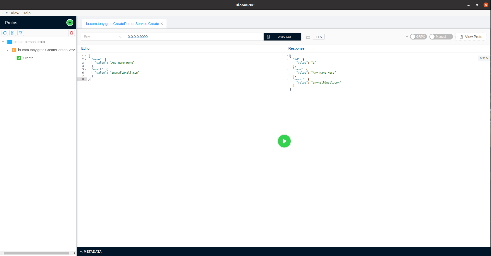
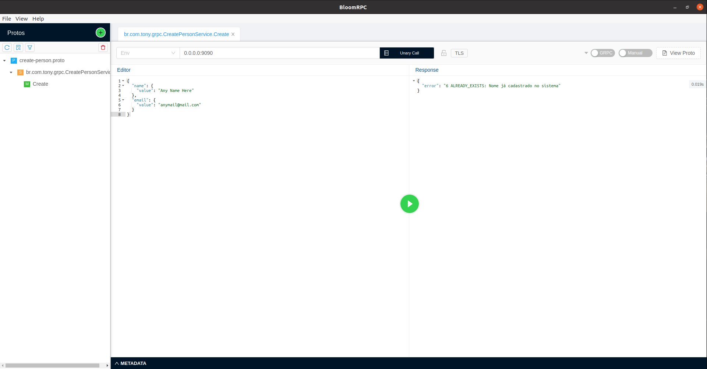

## Exemplo de uso do gRPC com Spring Boot e [ExceptionHandler](https://github.com/TonyALS/integrated-tests-grpc/blob/main/src/main/java/br/com/tony/grpc/resources/handler/ExceptionHandler.java) para captura de exceções

## Stack:
- Spring Boot 2.4.5;
- Java 11;
- [gRPC-Spring-Boot-Starter](https://yidongnan.github.io/grpc-spring-boot-starter/en/) para suporte do Spring Boot ao gRPC

## Como executar
- Tenha instalado em sua máquina um client RPC como [BloomRPC](https://github.com/uw-labs/bloomrpc) ou [Insomnia](https://insomnia.rest/download) para fazer as requisições;

- Clone o repositório, na guia de plugins do Maven execute o protobuf:compile e protobuf:compile-custom para que os stubs gRPC sejam gerados;

- Execute a aplicação (por padrão o servidor estará alocado em localhost:9090);

- Abra o seu client RPC de preferência e importe o arquivo .proto que está na pasta **src/main/proto/create-person.proto**;

- Preencha o payload de requisição conforme exemplo:
```javascript
{
  "name": {
    "value": "Any Name Here"
  },
  "email": {
    "value": "anymail@mail.com"
  }
}
```
Esta requisição retornará sucesso:



Se a mesma requisição for feita novamente um erro de **AlreadyExistsException** será apresentado:



Este erro está sendo capturado na classe [gRPC ExceptionHandler](https://github.com/TonyALS/integrated-tests-grpc/blob/main/src/main/java/br/com/tony/grpc/resources/handler/ExceptionHandler.java).

Para mais detalhes, consulte a documentação da biblioteca: [gRPC-Spring-Boot-Starter](https://yidongnan.github.io/grpc-spring-boot-starter/en/)
